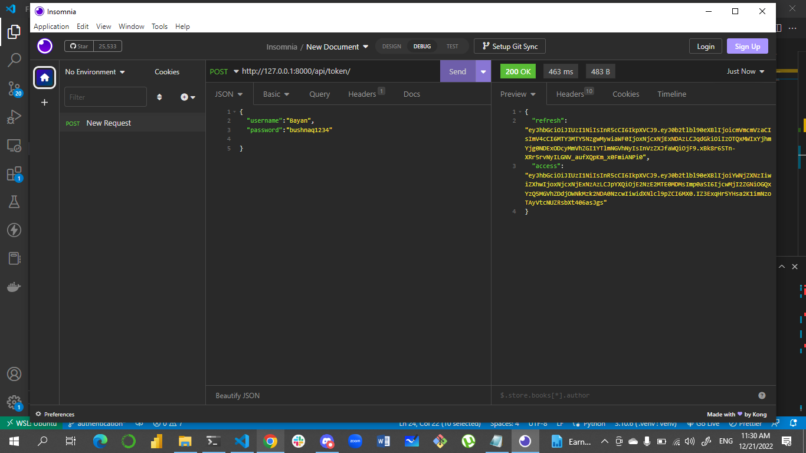

# LAB - Class 28

## Project: Authentication & Production Server

### Author: Bayan bushnaq

### Setup

#### `.env` requirements (where applicable)
#### `django` 
#### `docker`
#### `pycopg3`

#### How to initialize/run your application (where applicable)

- e.g. `python manage.py runserver`
-      `python manage.py managemigration`
-      `python manage.py migrate`
-      `docker run project name `

#### Tests

- How do you run tests?
### python manage.py test
- Any tests of note?
### No.

### Insomnia tests
 * install insomnia from this link (https://insomnia.rest/)
 *  open the insomnia app then test the 'post' url (http://127.0.0.1:8000/api/v1/languages/)
    * 
 * after login as admin : "username":"Bayan" , "password":"bushnaq1234"
    * 
 * try to get by using access token
     * 
 * try to post some fields using access token
     * 
 * try to post field after access token expired  
    * 
* try to get the access token by refresh token
    * 

#### Pull Request Link:
##### [pull request](https://github.com/BayanBushnaq/Authentication-Production-Server/pull/1)
